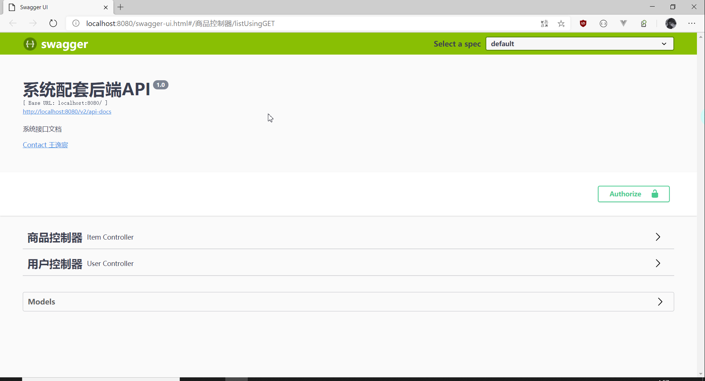
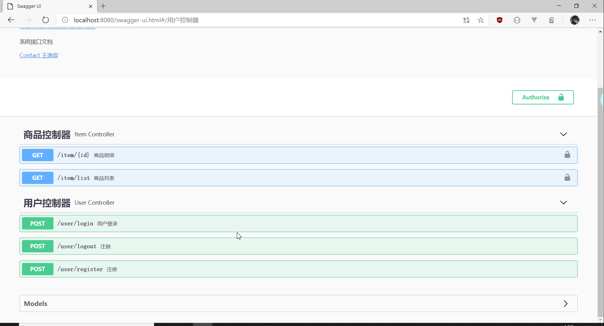
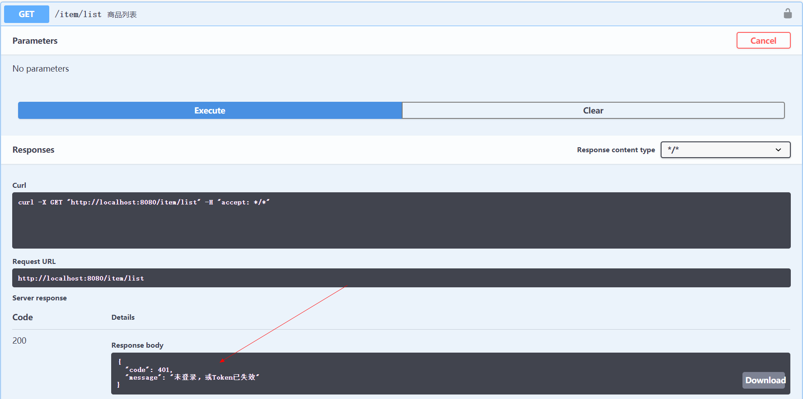
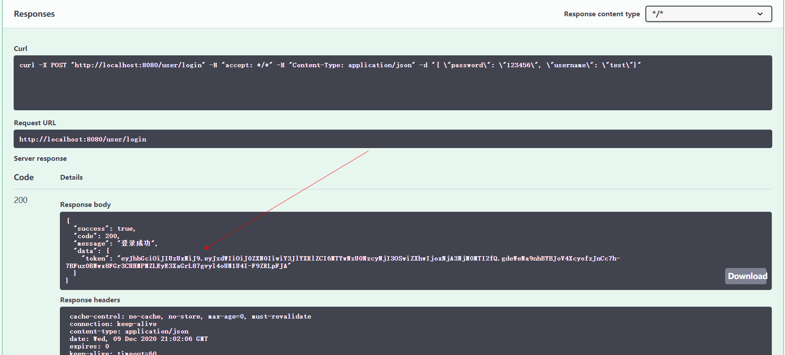
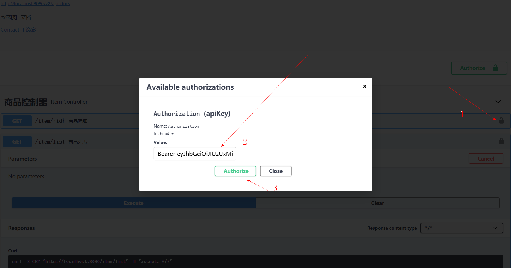
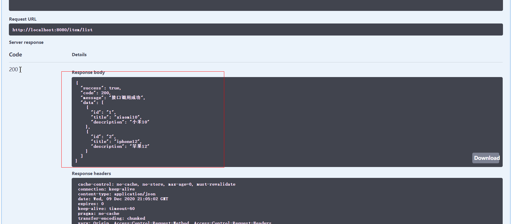

SpringBoot集成SpringSecurity进行权限控制

---

> 本案例共使用5张数据表进行权限控制，如果感觉粒度太细，也可以使用3张表。

### 表结构

- 用户数据表：`tb_user`

|字段|类型|说明|
|---|---|---|
|id |varchar |主键ID|
|username |varchar |用户名|
|password |varchar |用户密码|

- 用户角色表：`tb_role`

|字段|类型|说明|
|---|---|---|
|id |varchar |主键ID|
|value |varchar |角色值|
|description |varchar |角色说明|

- 用户角色关系表：`tb_user_role`

|字段|类型|说明|
|---|---|---|
|id |varchar |主键ID|
|user_id |varchar |用户ID|
|role_id |varchar |角色ID|

- 用户权限表：`tb_permission`

|字段|类型|说明|
|---|---|---|
|id |varchar |主键ID|
|value |varchar |权限值|
|description |varchar |权限说明|
|p_id |varchar |权限级联：父级ID|

- 用户角色权限关系表：`tb_role_permission`

|字段|类型|说明|
|---|---|---|
|id |varchar |主键ID|
|role_id |varchar |角色ID|
|permission_id |varchar |权限ID|

- 商品演示表：`tb_item`

|字段|类型|说明|
|---|---|---|
|id |varchar |主键ID|
|title |varchar |商品标题|
|description |varchar |商品说明|

### 项目测试

1. 启动项目，访问swagger文档：`http://localhost:8080/swagger-ui.html#`
    
    
   
2. 未登录访问测试接口
    

3. 登录获取token
    
   
4. 携带token再次访问接口
    
    
    数据访问成功
   
   
5. 切换无权限账号再次访问。。。略